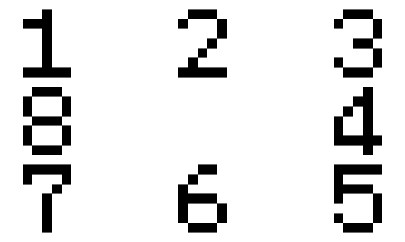

# Charting

OpenMochi uses the TJA format for charting songs. They can be opened with any text editor, or with a visual editor such as PeepoDrumKit. PeepoDrumKit currently does not support around 75% of the notes shown here, therefore it is not viable for experimental charting. It can be used instead for traditional charts.

## Note Types

There are many notes supported by OpenMochi. Some are commonly used in every chart, while others appear less often. Some may also be exclusive to other modes, or have different behaviors.

Listed here is every note type used in-game. Please use [Charting Practices](./charting-practices) to see what is considered good to use for charting at various levels.

|ID|Name|Details|
|:---:|:---:|:---:|
|0|Empty|Essential in spacing apart notes, as well as assisting in creating complex patterns.|
|1|Red Mochi||
|2|Blue Mochi||
|3|White Red Mochi|Same as the Red Mochi, but pressing both sides at the same time doubles the score gained.|
|4|White Blue Mochi|Same as the Blue Mochi, but pressing both sides at the same time doubles the score gained.|
|S|Shoulder Mochi|Requires the player to press the specified shoulder button. The values are specified using the `DIR` tag.|
|5|Start of Drumroll|Marks the beginning of a drumroll. Use 0 to increase the length of the drumroll, and 8 to end the drumroll.|
|7|Start of Balloon|Marks the beginning of a balloon. Use 0 to increase the length of the drumroll, and 8 to end the drumroll. Similar to the drumroll, but must be hit a certain amount within a time limit to be cleared. Balloon value is specified by the `BALLOON` tag.|
|8|End of long note|Marks the end of any long (drumroll/balloon) note.|
|9|Start of Yam|Marks the beginning of a yam note (functions identically to kusudamas). Use 0 to increase the length of the yam, and 8 to end the yam. Yam values are specified by the `BALLOON` tag.|
|A|ABXY Mochi|Requires the player to press the specified face button. The values are specified using the `DIR` tag.|
|B|Directional Mochi|Requires the player to press the specified side of the D-Pad. The values are specified using the `DIR` tag.|
|C|Bomb|A note that players should actively avoid hitting. Breaks combo and drastically drops gauge if hit.|
|F|Adlib|Appears invisible by default, does not affect current combo, does not add onto the player's current score, and is not required to be hit. If hit, a special hitsound plays.|
|G|Purple Mochi|Requires the player to press any red and blue button at the same time.|
|H|Silver Mochi|Press any of the shoulder buttons or triggers.|
|I|Rainbow Mochi|Hit any button on the controller.|
|J|Face Button Mochi|Press any of the face buttons.|
|K|D-Pad Mochi|Press any direction on the D-Pad.|
|L|Dark Red Mochi|Hit any button on the left side of the controller.|
|M|Dark Blue Mochi|Hit any button on the right side of the controller.|
|N|Apricot Mochi|Flick the left or right stick in the specified direction. The value is specified using the `DIR` tag.|
|O|Green Mochi|Requires the player to press the A button or the ZR trigger.|
|W|White Mochi|Requires the player to hit the ZL or ZR trigger.|
|Y|Yellow Mochi|Requires the player to hit left on the D-Pad or the ZL trigger.|
|Z|Start of Hold|Marks the beginning of a hold note. Use 0 to increase the length of the drumroll, and 8 to end the hold.|

## Tags

Listed here are various tags that are used throughout charting.

|Tag|Name|Details|
|:---:|:---:|:---:|
|`DIR`|Direction|Used to indicate what directions should be used for various direction based notes. Must be specified using a number from 1 to 8.  ABXY and Directional Mochi can only use 2, 4, 6, and 8, while Shoulder Mochi can only use 1 and 3.|
|`BALLOON`|Balloon|Used to indicate how many hits are needed to pop balloons and yams. This must be a whole number.|